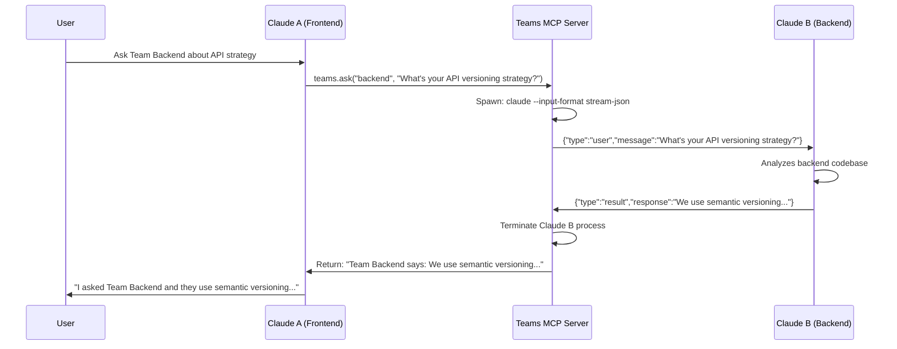

# Teams MCP: Cross-Project AI Agent Communication System

**A Revolutionary Model Context Protocol Server for Inter-Codebase Claude Code Collaboration**

---

## 🎯 Executive Summary

Teams MCP is a groundbreaking MCP server that enables **direct communication between Claude Code instances across different project directories**. It allows Claude working in Project A to seamlessly coordinate with Claude in Project B through bidirectional stdio streaming, creating the first true cross-codebase AI collaboration system.

**The Core Innovation:** Instead of switching contexts manually, you stay in Project A's Claude Code session and say:

> *"Using teams MCP, ask Team Backend what their API versioning strategy is"*

Claude A sends the question via Teams MCP → Teams MCP launches Claude B in the backend directory → Claude B analyzes their codebase and responds → Teams MCP relays the answer back → Claude A incorporates it into your conversation.

**This has never been done before.**

---

## 🌟 The Vision

### The Problem

Modern software development involves multiple codebases (frontend, backend, mobile, infrastructure) that must stay synchronized. When you make a breaking change in one project, you need to:

1. **Context Switch**: Stop work, navigate to other project
2. **Launch New Claude**: Start fresh Claude Code session
3. **Explain Context**: Re-explain what changed and why
4. **Copy/Paste**: Manually transfer information between projects
5. **Repeat**: Do this for every affected project

This workflow is **slow, error-prone, and breaks your flow state**.

### The Solution: Teams MCP

**Single Command Coordination:**

```
You (in Project A): "I'm changing the User model to add 'lastLoginDate'.
Using teams MCP, coordinate with Team Frontend and Team Backend to update their code."

Claude A:
  → Calls teams.send_message("frontend", "User model adding lastLoginDate field...")
  → Calls teams.send_message("backend", "User model adding lastLoginDate field...")

Teams MCP:
  → Launches Claude Code in /projects/team-frontend via stdio streaming
  → Launches Claude Code in /projects/team-backend via stdio streaming
  → Waits for responses from both teams
  → Relays responses back to Claude A

Claude B (Frontend): "Updated TypeScript interfaces in user.types.ts"
Claude C (Backend): "Added migration and updated user schema"

Claude A: "All teams coordinated. Frontend and Backend have been updated."
```

**You never left Project A. You never switched context. The coordination happened automatically.**

---

## 🏗️ Technical Architecture

### Core Components

```
┌─────────────────────────────────────────────────────────────────┐
│                     Teams MCP Server                             │
│                   (Message Broker & Orchestrator)                │
│                                                                   │
│  ┌────────────────────────────────────────────────────────────┐ │
│  │  MCP Tools:                                                 │ │
│  │  • teams.send_message(team_name, message, wait_for_reply)  │ │
│  │  • teams.ask(team_name, question)                          │ │
│  │  • teams.notify(team_name, message)                        │ │
│  │  • teams.get_status(team_name)                             │ │
│  └────────────────────────────────────────────────────────────┘ │
│                                                                   │
│  ┌────────────────────────────────────────────────────────────┐ │
│  │  Team Registry:                                             │ │
│  │  {                                                          │ │
│  │    "frontend": "/projects/acme-frontend",                  │ │
│  │    "backend": "/projects/acme-backend",                    │ │
│  │    "mobile": "/projects/acme-mobile"                       │ │
│  │  }                                                          │ │
│  └────────────────────────────────────────────────────────────┘ │
│                                                                   │
│  ┌────────────────────────────────────────────────────────────┐ │
│  │  Stdio Process Manager:                                     │ │
│  │  • Spawns: claude --input-format stream-json               │ │
│  │            --output-format stream-json                     │ │
│  │  • Pipes messages via stdin                                │ │
│  │  • Captures responses from stdout                          │ │
│  │  • Terminates when complete                                │ │
│  └────────────────────────────────────────────────────────────┘ │
└─────────────────────────────────────────────────────────────────┘
           ↓                    ↓                    ↓

┌──────────────────┐  ┌──────────────────┐  ┌──────────────────┐
│   Team Frontend  │  │   Team Backend   │  │    Team Mobile   │
│                  │  │                  │  │                  │
│ Claude Code      │  │ Claude Code      │  │ Claude Code      │
│ (stdio stream)   │  │ (stdio stream)   │  │ (stdio stream)   │
│                  │  │                  │  │                  │
│ • Local context  │  │ • Local context  │  │ • Local context  │
│ • .claude/       │  │ • .claude/       │  │ • .claude/       │
│ • MCP servers    │  │ • MCP servers    │  │ • MCP servers    │
│ • Project files  │  │ • Project files  │  │ • Project files  │
└──────────────────┘  └──────────────────┘  └──────────────────┘
```

### Message Flow Sequence



### Stdio Streaming Protocol

Claude Code supports bidirectional streaming via NDJSON (newline-delimited JSON):

**Input Format (`--input-format stream-json`):**
```json
{"type":"user","message":{"role":"user","content":"Your message here"},"session_id":"team-backend-session"}
{"type":"user","message":{"role":"user","content":"Follow-up question"},"session_id":"team-backend-session"}
```

**Output Format (`--output-format stream-json`):**
```json
{"type":"init","session_id":"abc123"}
{"type":"message","role":"assistant","content":"I'll help with that..."}
{"type":"tool_use","name":"Read","input":{"path":"api/schema.ts"}}
{"type":"result","response":"Here's the final answer...","status":"completed"}
```

**Key Command:**
```bash
cd /projects/team-backend
claude --input-format stream-json --output-format stream-json
```

---

## 🆚 Comparison to Existing Solutions

### Existing Multi-Agent Systems

| Project | Description | Limitations |
|---------|-------------|-------------|
| **[Symphony of One MCP](https://github.com/ai-wes/symphony-of-one-mcp)** | Multiple Claude instances collaborating through centralized hub | ❌ Single shared workspace only<br>❌ Chat room based, not direct messaging<br>❌ Uses Socket.IO, not stdio streaming |
| **[Claude-Flow](https://github.com/ruvnet/claude-flow)** | Hive-mind intelligence with swarm coordination | ❌ Single project context<br>❌ No cross-codebase communication<br>❌ Complex orchestration graph required |
| **[Agent-MCP](https://github.com/rinadelph/Agent-MCP)** | Multi-agent framework with MCP | ❌ Agents work within same project<br>❌ No team/project isolation<br>❌ Shared memory model, not independent contexts |
| **[Claude Code MCP Server](https://github.com/nexus-digital-automations/claude_code_mcp_2)** | Orchestrate Claude agents across iTerm2 | ❌ Terminal-specific (iTerm2 only)<br>❌ Manual session management<br>❌ No automatic context routing |
| **[Zen MCP](https://github.com/BeehiveInnovations/zen-mcp-server)** | Multi-model coordination for Claude Code | ❌ Different AI models, not different projects<br>❌ Single codebase focus |
| **[AutoGen](https://microsoft.github.io/autogen/)** | Multi-agent conversation framework | ❌ Python/programming specific<br>❌ Not integrated with Claude Code<br>❌ No project isolation |
| **[Semantic Kernel Orchestration](https://learn.microsoft.com/en-us/semantic-kernel/frameworks/agent/agent-orchestration/)** | Agent coordination patterns | ❌ General framework, not Claude-specific<br>❌ No native stdio streaming |

### Comparison Matrix

| Feature | Teams MCP | Symphony of One | Claude-Flow | Agent-MCP | Others |
|---------|-----------|-----------------|-------------|-----------|--------|
| **Cross-Project Communication** | ✅ | ❌ | ❌ | ❌ | ❌ |
| **Independent Team Contexts** | ✅ | ❌ | ❌ | ❌ | ❌ |
| **Direct Agent-to-Agent Messaging** | ✅ | ❌ | ❌ | ❌ | ❌ |
| **Bidirectional Stdio Streaming** | ✅ | ❌ | ❌ | ❌ | ❌ |
| **Per-Team MCP Server Access** | ✅ | ❌ | ❌ | ❌ | ❌ |
| **"Ask Team X" Natural Language** | ✅ | ❌ | ❌ | ❌ | ❌ |
| **Zero Shared State** | ✅ | ❌ | ❌ | ❌ | ❌ |
| **Project-Specific .claude/ Config** | ✅ | ❌ | ❌ | ❌ | ❌ |
| **Fire & Forget Notifications** | ✅ | ❌ | ❌ | ❌ | ❌ |
| **Synchronous Ask/Reply Pattern** | ✅ | ❌ | ❌ | ❌ | ❌ |

---

## 🔥 What Makes Teams MCP Revolutionary

### 1. **First True Cross-Codebase Coordination**

All existing solutions work within a **single project boundary**. Teams MCP breaks this limitation by enabling communication between completely independent codebases, each with their own:

- Directory structure
- Dependencies and node_modules
- `.claude/` configuration
- MCP servers
- Git repositories
- Team-specific context

**Example:** Your frontend in TypeScript/React can coordinate with your backend in Python/Django, and your mobile app in Swift—all simultaneously.

### 2. **Context Isolation = Better Results**

Each team's Claude instance maintains **complete context isolation**:

```
Team Frontend Claude knows:
✅ React components, Tailwind classes, Redux patterns
✅ Frontend-specific MCP servers (Figma, Storybook)
✅ Frontend CLAUDE.md context
❌ Backend database schemas
❌ Mobile iOS/Android specifics

Team Backend Claude knows:
✅ Database schemas, API endpoints, migrations
✅ Backend-specific MCP servers (PostgreSQL, Redis)
✅ Backend CLAUDE.md context
❌ Frontend component structure
❌ Mobile app architecture
```

This isolation means **more accurate, specialized responses** from each team agent.

### 3. **Natural Language Collaboration**

Instead of rigid APIs or function calls, communication happens in natural language:

```
"Ask Team Mobile if they support push notifications yet"
"Tell Team Backend we're deprecating the /v1/users endpoint"
"Coordinate with all teams to update the User model"
```

The MCP server handles the orchestration, but the agents communicate like human team members would.

### 4. **Leverages Existing Claude Code Features**

Teams MCP doesn't reinvent the wheel—it builds on Claude Code's native capabilities:

- **Stdio streaming** (already supported)
- **Project-specific MCP servers** (already supported)
- **Session management** (already supported)
- **.claude/ configurations** (already supported)

It simply provides the **missing coordination layer**.

### 5. **Addresses Real Developer Pain**

From GitHub Issue [#2929](https://github.com/anthropics/claude-code/issues/2929):

> "Could be done with all sorts of APIs... MCP (meaning each instance of claude could expose its own MCP server, or register itself to a global MCP server of all claudes on the system, to make itself discoverable and callable from other claudes)...
>
> Use cases are infinite. Here are some: generalists vs specialists claudes: I could have a specialist claude run on my specific server answering to natural language requests, while a local generalist claude call it, having no clue of the specific API."

**Developers are already asking for this!** Teams MCP delivers it.

---

## 💡 Use Cases

### 1. **Breaking Change Propagation**

**Scenario:** You modify a shared API contract in the backend

```
You (in Backend): "I'm changing the /users endpoint to require authentication.
Using teams MCP, notify all consuming teams and help them update."

Backend Claude:
  → teams.notify("frontend", "Breaking change: /users now requires auth header")
  → teams.notify("mobile", "Breaking change: /users now requires auth header")
  → teams.notify("analytics", "Breaking change: /users now requires auth header")

Each team's Claude receives the notification on their next session:
  "You have a pending message from Team Backend..."
```

### 2. **Cross-Team Code Review**

**Scenario:** Frontend needs backend expertise

```
You (in Frontend): "I'm seeing 500 errors from the API. Ask Team Backend
what could cause this error response."

Frontend Claude → Teams MCP → Backend Claude analyzes logs and error handlers

Backend Claude: "The 500 errors occur when the database connection pool is exhausted.
You should implement exponential backoff retries."

Frontend Claude implements retry logic based on backend's recommendation.
```

### 3. **Feature Coordination**

**Scenario:** Implementing a feature across multiple codebases

```
You (in Backend): "I've implemented real-time notifications via WebSocket.
Ask Team Frontend if they're ready to integrate, and ask Team Mobile about
their WebSocket library support."

Backend Claude:
  → teams.ask("frontend", "Ready for WebSocket integration? Port 8080")
  → teams.ask("mobile", "Do you have WebSocket library support?")

Frontend Claude: "Yes, we use socket.io-client. Can integrate this week."
Mobile Claude: "Using Starscream for iOS. Need connection URL and auth flow docs."

Backend Claude: "Frontend ready this week. Mobile needs documentation."
```

### 4. **Dependency Updates**

**Scenario:** Core library version upgrade

```
You (in Shared Libs): "We're upgrading to React 19. Using teams MCP,
check which teams are affected and help them update."

Libs Claude:
  → teams.ask("frontend", "You use React 18.2. Can you upgrade to 19?")
  → teams.ask("admin-dashboard", "You use React 18.2. Can you upgrade to 19?")
  → teams.ask("mobile", "Do you use any React Native dependencies?")

Collects responses, identifies blockers, creates upgrade plan.
```

### 5. **Architecture Decisions**

**Scenario:** Need consensus across teams

```
You (in Infrastructure): "We're considering migrating from REST to GraphQL.
Get opinions from all engineering teams."

Infrastructure Claude:
  → teams.ask("frontend", "Thoughts on migrating to GraphQL?")
  → teams.ask("backend", "Can you implement GraphQL resolvers?")
  → teams.ask("mobile", "Do you have GraphQL client libraries?")

Synthesizes responses into recommendation document.
```

---

## 🛠️ Implementation Plan

### Phase 1: Core MCP Server (MVP)

**File Structure:**
```
teams-mcp/
├── src/
│   ├── server.ts              # MCP server entry point
│   ├── teams-registry.ts      # Team directory mapping
│   ├── stdio-manager.ts       # Claude Code process spawning
│   ├── message-broker.ts      # Message routing and queuing
│   └── tools/
│       ├── send-message.ts    # teams.send_message tool
│       ├── ask.ts             # teams.ask tool
│       ├── notify.ts          # teams.notify tool
│       └── get-status.ts      # teams.get_status tool
├── config/
│   └── teams.json             # Team registry configuration
├── package.json
└── README.md
```

**teams.json Example:**
```json
{
  "teams": {
    "frontend": {
      "path": "/Users/dev/projects/acme-frontend",
      "description": "React TypeScript frontend"
    },
    "backend": {
      "path": "/Users/dev/projects/acme-backend",
      "description": "Node.js Express API"
    },
    "mobile": {
      "path": "/Users/dev/projects/acme-mobile",
      "description": "React Native mobile app"
    }
  }
}
```

**MCP Tools Implementation:**

```typescript
// teams.send_message(team_name, message, wait_for_reply)
{
  name: "teams_send_message",
  description: "Send a message to another team's Claude Code instance",
  parameters: {
    team_name: { type: "string", description: "Target team name" },
    message: { type: "string", description: "Message to send" },
    wait_for_reply: { type: "boolean", default: true }
  }
}

// teams.ask(team_name, question)
{
  name: "teams_ask",
  description: "Ask another team a question and wait for their response",
  parameters: {
    team_name: { type: "string", description: "Target team name" },
    question: { type: "string", description: "Question to ask" }
  }
}

// teams.notify(team_name, message)
{
  name: "teams_notify",
  description: "Send async notification to team (fire and forget)",
  parameters: {
    team_name: { type: "string", description: "Target team name" },
    message: { type: "string", description: "Notification message" }
  }
}

// teams.get_status(team_name?)
{
  name: "teams_get_status",
  description: "Check team status or list all teams",
  parameters: {
    team_name: { type: "string", optional: true }
  }
}
```

**Stdio Process Management:**

```typescript
import { spawn } from 'child_process';

class StdioManager {
  async sendMessageToTeam(teamName: string, message: string): Promise<string> {
    const teamConfig = this.getTeamConfig(teamName);

    // Spawn Claude Code with stdio streaming
    const claude = spawn('claude', [
      '--input-format', 'stream-json',
      '--output-format', 'stream-json',
      '--dangerously-skip-permissions' // Optional: auto-approve actions
    ], {
      cwd: teamConfig.path,
      stdio: ['pipe', 'pipe', 'pipe']
    });

    // Send message via stdin
    const stdinMessage = JSON.stringify({
      type: 'user',
      message: {
        role: 'user',
        content: message
      },
      session_id: `teams-${teamName}-${Date.now()}`
    }) + '\n';

    claude.stdin.write(stdinMessage);

    // Collect response from stdout
    let response = '';
    return new Promise((resolve, reject) => {
      claude.stdout.on('data', (data) => {
        const lines = data.toString().split('\n');
        for (const line of lines) {
          if (!line.trim()) continue;
          try {
            const parsed = JSON.parse(line);
            if (parsed.type === 'result') {
              claude.kill();
              resolve(parsed.response || parsed.content);
            }
          } catch (e) {
            // Continue reading
          }
        }
      });

      claude.on('close', (code) => {
        if (response) resolve(response);
        else reject(new Error(`Process exited with code ${code}`));
      });
    });
  }
}
```

### Phase 2: Advanced Features

1. **Message Queue for Async Notifications**
   - Store notifications in SQLite/file system
   - Each team's Claude checks for pending messages on startup
   - Display via custom hook or startup prompt

2. **Conversation Threading**
   - Track multi-turn conversations between teams
   - Maintain context across multiple ask/reply cycles
   - Session persistence

3. **Team Discovery**
   - Auto-detect team directories from monorepo structure
   - Scan for `.claude/` directories
   - Interactive team registration CLI

4. **Security & Access Control**
   - Team-specific permissions (who can message whom)
   - Rate limiting to prevent spam
   - Message audit logging

5. **Rich Message Formats**
   - Attach file diffs
   - Include code snippets
   - Reference specific commits/PRs

### Phase 3: Ecosystem Integration

1. **GitHub Integration**
   - Create cross-repo issues automatically
   - Link conversations to PRs
   - Tag teams in issue comments

2. **Slack/Discord Webhooks**
   - Notify human team members of agent conversations
   - Allow humans to inject into agent conversations
   - Escalation workflows

3. **Monitoring Dashboard**
   - Visualize team communication patterns
   - Track response times
   - Identify bottlenecks

---

## 📚 Research & References

### Claude Code Documentation

- **[CLI Reference](https://docs.claude.com/en/docs/claude-code/cli-reference)** - Official Claude Code command-line documentation
- **[MCP Documentation](https://docs.claude.com/en/docs/claude-code/mcp)** - Connecting Claude Code to tools via MCP
- **[Streaming Input Mode](https://docs.claude.com/en/docs/claude-code/sdk/streaming-vs-single-mode)** - Documentation on stream-json input/output formats

### Model Context Protocol

- **[MCP GitHub Repository](https://github.com/modelcontextprotocol)** - Official MCP protocol specification
- **[Anthropic MCP Announcement](https://www.anthropic.com/news/model-context-protocol)** - Original MCP announcement and rationale
- **[Building with MCP](https://docs.claude.com/en/api/agent-sdk/overview)** - Agent SDK and MCP integration guide

### Stream Chaining & Multi-Agent

- **[Claude-Flow Wiki: Stream Chaining](https://github.com/ruvnet/claude-flow/wiki/Stream-Chaining)** - Using stream-json for agent pipelines
- **[Multi-Agent Orchestration (Part 3)](https://dev.to/bredmond1019/multi-agent-orchestration-running-10-claude-instances-in-parallel-part-3-29da)** - Running 10+ Claude instances in parallel

### Existing Multi-Agent Systems

- **[Symphony of One MCP](https://github.com/ai-wes/symphony-of-one-mcp)** - Multi-Claude collaboration hub (closest existing solution)
- **[Agent-MCP Framework](https://github.com/rinadelph/Agent-MCP)** - Multi-agent coordination via MCP
- **[Claude Code MCP Server](https://github.com/nexus-digital-automations/claude_code_mcp_2)** - Orchestrating Claude agents
- **[lastmile-ai/mcp-agent](https://github.com/lastmile-ai/mcp-agent)** - Building effective agents with MCP
- **[AutoGen](https://microsoft.github.io/autogen/0.2/docs/Use-Cases/agent_chat/)** - Multi-agent conversation framework by Microsoft

### Orchestration Patterns

- **[Azure AI Agent Orchestration Patterns](https://learn.microsoft.com/en-us/azure/architecture/ai-ml/guide/ai-agent-design-patterns)** - Sequential, concurrent, group chat, handoff, magentic patterns
- **[Semantic Kernel Multi-Agent Orchestration](https://devblogs.microsoft.com/semantic-kernel/semantic-kernel-multi-agent-orchestration/)** - Microsoft's orchestration framework
- **[Agent Communication in Multi-Agent Systems (SmythOS)](https://smythos.com/developers/agent-development/agent-communication-in-multi-agent-systems/)** - Communication protocols and coordination

### Agent-to-Agent Communication

- **[A2A Protocol (O'Reilly)](https://www.oreilly.com/radar/designing-collaborative-multi-agent-systems-with-the-a2a-protocol/)** - Agent-to-agent communication standard
- **[AI Agent Orchestration (IBM)](https://www.ibm.com/think/topics/ai-agent-orchestration)** - Centralized, decentralized, and hierarchical orchestration
- **[Multi-Agent Coordination Strategies (Galileo)](https://galileo.ai/blog/multi-agent-coordination-strategies)** - Preventing coordination failures

### Community Discussions

- **[GitHub Issue #2929](https://github.com/anthropics/claude-code/issues/2929)** - "Programmatically drive claude instances" - Feature request for exactly this functionality!
- **[Claude Code Best Practices](https://www.anthropic.com/engineering/claude-code-best-practices)** - Official best practices including multi-agent patterns

---

## 🚀 Why This Project Matters

### Fills Critical Gaps in AI Tooling

IBM's research on multi-agent systems identified that **"many multi-agent projects struggle with disseminating information between agents and tool output parsing errors, and these impediments can be remedied with MCP."**

However, all existing MCP implementations focus on **single-project contexts**. Teams MCP extends MCP's power to **cross-project coordination**, filling a critical gap in the ecosystem.

### Enables True Team-Scale AI

Current AI coding tools operate at the **individual developer** or **single repository** level. Teams MCP scales this to the **team** and **organization** level by enabling:

- **Microservices coordination** across service boundaries
- **Frontend-backend synchronization** without manual coordination
- **Monorepo team isolation** with controlled inter-team communication
- **Specialist agent consultation** (security agent, performance agent, etc.)

### Reduces Context Switching Overhead

Studies show developers lose **23 minutes of productivity** on average when context switching between projects. Teams MCP eliminates this by allowing:

- Stay in your current project while coordinating changes
- No need to explain context to multiple Claude instances
- Automatic routing of questions to the right specialist agent

### Foundation for Future Innovations

Teams MCP creates the foundation for:

- **AI Team Leads**: Meta-agents that orchestrate multiple specialist agents
- **Autonomous Feature Development**: End-to-end feature implementation across services
- **24/7 Coordination**: Agents working while humans sleep
- **Cross-Organization Collaboration**: Different companies' agents coordinating on integrations

---

## 🎉 Conclusion

Teams MCP represents a **paradigm shift** in how AI coding assistants collaborate. By enabling **cross-project communication through stdio streaming**, it solves real developer pain points that no existing solution addresses.

**What makes this revolutionary:**

✅ **First cross-codebase agent coordination system**
✅ **True team context isolation**
✅ **Natural language collaboration between specialized agents**
✅ **Leverages existing Claude Code infrastructure**
✅ **Solves actively requested community need**

This isn't just an incremental improvement—it's a **fundamental building block** for the future of AI-assisted software development at scale.

**The future of development isn't one AI assistant per developer.**
**It's one AI team per human team.**

Teams MCP makes that future possible today.

---

## 📞 Get Involved

- **GitHub:** [Coming Soon]
- **Documentation:** [Coming Soon]
- **Discord:** [Coming Soon]

**Let's build the future of cross-project AI collaboration together.**
